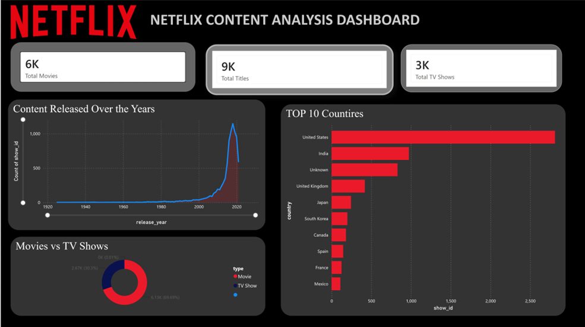
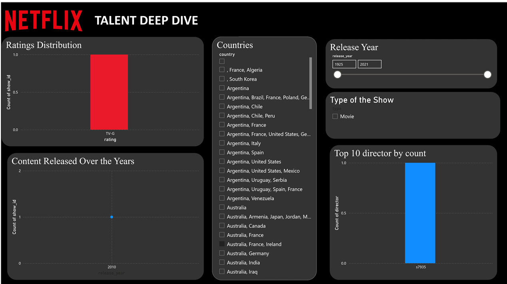

# 🎬 Netflix Content Analysis Dashboard

## 📌 Project Overview

This project presents an interactive **Netflix Content Analysis Dashboard** built using **Python** for data cleaning and **Power BI** for visualization. The dashboard provides insights into Netflix's movies and TV shows, helping users explore content distribution, ratings, release trends, countries, genres, and directors.

---

## 🚀 Objectives

* Clean and preprocess Netflix data using Python.
* Perform exploratory data analysis (EDA).
* Build an interactive Power BI dashboard.
* Visualize key trends and business insights.

---

## 🛠️ Tools & Technologies

* **Python**

  * Pandas
  * NumPy
  * Matplotlib
* **Jupyter Notebook**
* **Power BI**
* **Git & GitHub**

---

## 📂 Dataset

* **Dataset:** Netflix Movies and TV Shows
* **Source:** Kaggle
* **Records:** 8,800+ titles

---

## 📊 Dashboard Features

### KPI Cards

* Total Titles
* Total Movies
* Total TV Shows
* Average Movie Duration
* Average TV Seasons

### Visualizations

* 🍩 Movies vs TV Shows
* 🌍 Top 10 Countries by Number of Titles
* 📈 Content Released Over the Years
* ⭐ Ratings Distribution
* 🎭 Top Genres
* 🎬 Top 10 Directors by Title Count
* ⏱️ Movie Duration Distribution

### Interactive Filters

* Type
* Country
* Rating
* Release Year

---

## 📷 Dashboard Preview

> Add your dashboard screenshots below.





---

## 📁 Project Structure

```text
Netflix-Data-Analysis/
│
├── Dashboard/
│   ├── Netflix_Content_Analysis.pbix
│   └── Netflix_Dashboard.pdf
│
├── Data/
│   └── netflix_cleaned.csv
│
├── Python/
│   └── netflix_analysis.ipynb
│
├── Images/
│   └── dashboard.png
│
└── README.md
```

---

## 🔍 Key Insights

* Movies make up a larger portion of the Netflix catalog than TV Shows.
* The United States contributes the highest number of titles.
* Netflix content has grown significantly in recent years.
* TV-MA is the most common content rating.
* Drama and Comedy are among the most popular genres.
* A small number of directors are responsible for multiple Netflix titles.

---

## ▶️ How to Run This Project

1. Clone this repository.
2. Open the Jupyter Notebook in the **Python** folder to explore the data cleaning process.
3. Open **Netflix_Content_Analysis.pbix** in Power BI Desktop.
4. Interact with the slicers and visualizations to explore the dashboard.

---

## 📌 Future Enhancements

* Add advanced DAX measures.
* Create drill-through pages.
* Include bookmarks for interactive navigation.
* Publish the dashboard to the Power BI Service.
* Integrate live or regularly updated datasets.

---

## 👩‍💻 Author

**Nisha Subramani**

Electrical and Electronics Engineering Student | Aspiring Software Developer | Data Analytics Enthusiast

---

⭐ If you found this project useful, consider giving the repository a **Star**.
